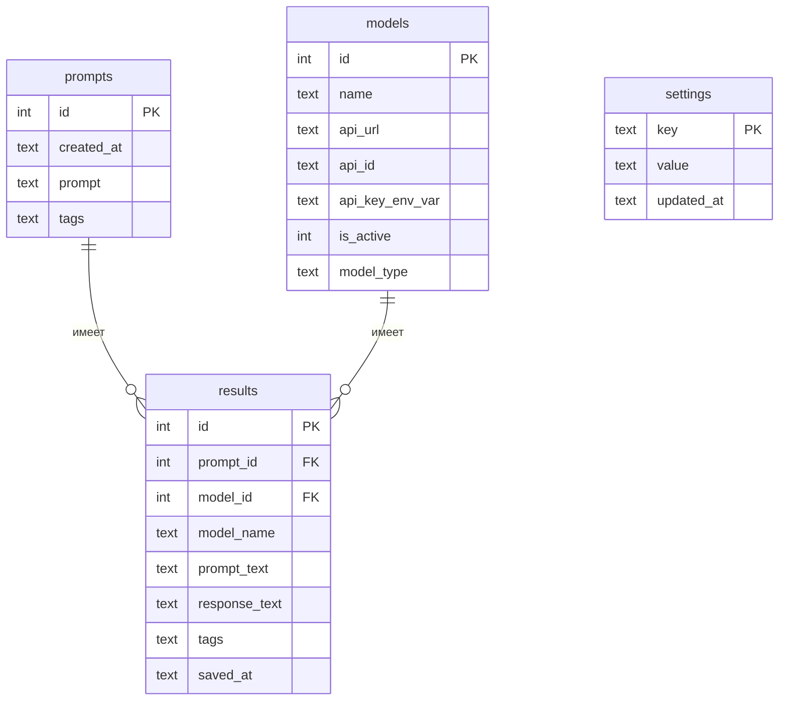

# Схема базы данных ChatList

База данных: **SQLite**, файл по умолчанию — `chatlist.db`.

Доступ к БД инкапсулирован в модуле `db.py`. API-ключи **не хранятся** в базе — только имя переменной окружения в поле `api_key_env_var`.

---

## Обзор таблиц



---

## Связи между таблицами

- Один промт (`prompts`) может иметь **множество** результатов (`results`).
- Одна модель (`models`) может иметь **множество** результатов (`results`).
- Каждый результат (`results`) относится к **одному** промту и **одной** модели.
- `results.prompt_id` связан с `prompts.id`.
- `results.model_id` связан с `models.id`.

При удалении промта или модели внешние ключи обнуляются (`ON DELETE SET NULL`), а сами записи в `results` **не удаляются**. Текстовые копии `prompt_text` и `model_name` сохраняют исторические данные даже при `prompt_id = NULL` или `model_id = NULL`.

---

## Таблица `prompts`

Хранит историю запросов пользователя.

| Поле         | Тип     | Ограничения                | Описание                           |
|--------------|---------|----------------------------|------------------------------------|
| `id`         | INTEGER | PRIMARY KEY, AUTOINCREMENT | Уникальный идентификатор           |
| `created_at` | TEXT    | NOT NULL                   | Дата и время создания (ISO 8601)   |
| `prompt`     | TEXT    | NOT NULL                   | Текст промта                       |
| `tags`       | TEXT    | NULL                       | Теги через запятую или JSON-массив |

**Индексы:**
- `idx_prompts_created_at` — сортировка по дате

**Пример записи:**

| id | created_at          | prompt                          | tags       |
|----|---------------------|---------------------------------|------------|
| 1  | 2026-07-16T12:00:00 | Объясни разницу между TCP и UDP | сеть,учёба |

---

## Таблица `models`

Справочник нейросетей, доступных для отправки запросов.

| Поле              | Тип     | Ограничения                | Описание                                                    |
|-------------------|---------|----------------------------|-------------------------------------------------------------|
| `id`              | INTEGER | PRIMARY KEY, AUTOINCREMENT | Уникальный идентификатор                                    |
| `name`            | TEXT    | NOT NULL, UNIQUE           | Отображаемое название модели                                |
| `api_url`         | TEXT    | NOT NULL                   | Адрес API (endpoint)                                        |
| `api_id`          | TEXT    | NOT NULL                   | Идентификатор модели в API или OpenRouter, например `openai/gpt-4o` |
| `api_key_env_var` | TEXT    | NOT NULL                   | Имя переменной окружения с API-ключом, например `OPENROUTER_API_KEY` |
| `is_active`       | INTEGER | NOT NULL, DEFAULT 1        | 1 — активна, 0 — отключена                                  |
| `model_type`      | TEXT    | NULL                       | Тип API: `openai`, `deepseek`, `groq`, `openrouter` и т.д.  |

**Примечания:**
- `api_id` — это идентификатор конкретной модели у провайдера API, **не** имя переменной ключа.
- `api_key_env_var` — имя переменной в `.env`; ключ читается при запросе: `os.getenv(model.api_key_env_var)`.

**Индексы:**
- `idx_models_is_active` — быстрый выбор активных моделей

**Пример записи:**

| id | name     | api_url                               | api_id              | api_key_env_var      | is_active | model_type |
|----|----------|---------------------------------------|---------------------|----------------------|-----------|------------|
| 1  | GPT-4o   | https://openrouter.ai/api/v1/chat/completions | openai/gpt-4o | OPENROUTER_API_KEY   | 1         | openrouter |
| 2  | DeepSeek | https://api.deepseek.com/v1/chat/completions  | deepseek-chat   | DEEPSEEK_API_KEY     | 1         | deepseek   |

**Пример `.env`:**

```env
OPENROUTER_API_KEY=sk-or-...
DEEPSEEK_API_KEY=sk-...
OPENAI_API_KEY=sk-...
```

---

## Таблица `results`

Постоянное хранилище **сохранённых** ответов (только строки с `selected = True` из временной таблицы).

| Поле            | Тип     | Ограничения                                      | Описание                                 |
|-----------------|---------|--------------------------------------------------|------------------------------------------|
| `id`            | INTEGER | PRIMARY KEY, AUTOINCREMENT                       | Уникальный идентификатор                 |
| `prompt_id`     | INTEGER | NULL, FOREIGN KEY → `prompts(id)` ON DELETE SET NULL | Ссылка на промт (может быть NULL)    |
| `model_id`      | INTEGER | NULL, FOREIGN KEY → `models(id)` ON DELETE SET NULL  | Ссылка на модель (может быть NULL)   |
| `model_name`    | TEXT    | NOT NULL                                         | Текстовая копия имени модели             |
| `prompt_text`   | TEXT    | NOT NULL                                         | Текстовая копия текста промта            |
| `response_text` | TEXT    | NOT NULL                                         | Текст ответа нейросети                   |
| `tags`          | TEXT    | NULL                                             | Теги промта на момент сохранения         |
| `saved_at`      | TEXT    | NOT NULL                                         | Дата и время сохранения (ISO 8601)       |

**Зачем дублировать `model_name` и `prompt_text`:**
- при удалении промта или модели (`prompt_id` / `model_id` станут `NULL`) сохранённый результат останется читаемым.

**Индексы:**
- `idx_results_saved_at` — сортировка по дате
- `idx_results_prompt_id` — фильтрация по промту
- `idx_results_model_id` — фильтрация по модели

**Пример записи:**

| id | prompt_id | model_id | model_name | prompt_text               | response_text     | tags | saved_at            |
|----|-----------|----------|------------|---------------------------|-------------------|------|---------------------|
| 1  | 1         | 1        | GPT-4o     | Объясни разницу между...  | TCP — надёжный... | сеть | 2026-07-16T12:05:00 |
| 2  | NULL      | NULL     | GPT-4o     | Удалённый промт...        | Ответ сохранён... | NULL | 2026-07-16T13:00:00 |

---

## Таблица `settings`

Ключ–значение для настроек программы.

| Поле         | Тип  | Ограничения | Описание                              |
|--------------|------|-------------|---------------------------------------|
| `key`        | TEXT | PRIMARY KEY | Имя настройки                         |
| `value`      | TEXT | NULL        | Значение настройки                    |
| `updated_at` | TEXT | NULL        | Дата последнего изменения (ISO 8601)  |

**Примеры настроек:**

| key               | value         | updated_at          | Описание                         |
|-------------------|---------------|---------------------|----------------------------------|
| `request_timeout` | `30`          | 2026-07-16T10:00:00 | Таймаут HTTP-запроса (секунды)   |
| `db_path`         | `chatlist.db` | 2026-07-16T10:00:00 | Путь к файлу базы данных         |
| `default_tags`    | `общее`       | 2026-07-16T10:00:00 | Теги по умолчанию для промтов    |
| `log_requests`    | `1`           | 2026-07-16T10:00:00 | Включить логирование запросов    |

---

## Временная таблица результатов (не в SQLite)

Текущая сессия ответов хранится **в памяти приложения**, не в базе данных.

| Поле            | Тип  | Описание                                |
|-----------------|------|-----------------------------------------|
| `model_name`    | TEXT | Название модели                         |
| `response_text` | TEXT | Текст ответа или сообщение об ошибке    |
| `selected`      | BOOL | Отмечен ли пользователем для сохранения |

**Жизненный цикл:**
1. Создаётся после отправки промта в активные модели.
2. Очищается при вводе нового промта.
3. Очищается после нажатия «Сохранить».
4. Выбранные строки (`selected = True`) переносятся в таблицу `results`.

---

## SQL-скрипт создания таблиц

```sql
PRAGMA foreign_keys = ON;

CREATE TABLE IF NOT EXISTS prompts (
    id         INTEGER PRIMARY KEY AUTOINCREMENT,
    created_at TEXT    NOT NULL,
    prompt     TEXT    NOT NULL,
    tags       TEXT
);

CREATE TABLE IF NOT EXISTS models (
    id              INTEGER PRIMARY KEY AUTOINCREMENT,
    name            TEXT    NOT NULL UNIQUE,
    api_url         TEXT    NOT NULL,
    api_id          TEXT    NOT NULL,
    api_key_env_var TEXT    NOT NULL,
    is_active       INTEGER NOT NULL DEFAULT 1,
    model_type      TEXT
);

CREATE TABLE IF NOT EXISTS results (
    id            INTEGER PRIMARY KEY AUTOINCREMENT,
    prompt_id     INTEGER,
    model_id      INTEGER,
    model_name    TEXT    NOT NULL,
    prompt_text   TEXT    NOT NULL,
    response_text TEXT    NOT NULL,
    tags          TEXT,
    saved_at      TEXT    NOT NULL,
    FOREIGN KEY (prompt_id) REFERENCES prompts(id) ON DELETE SET NULL,
    FOREIGN KEY (model_id)  REFERENCES models(id)  ON DELETE SET NULL
);

CREATE TABLE IF NOT EXISTS settings (
    key        TEXT PRIMARY KEY,
    value      TEXT,
    updated_at TEXT
);

CREATE INDEX IF NOT EXISTS idx_prompts_created_at ON prompts(created_at);
CREATE INDEX IF NOT EXISTS idx_models_is_active  ON models(is_active);
CREATE INDEX IF NOT EXISTS idx_results_saved_at  ON results(saved_at);
CREATE INDEX IF NOT EXISTS idx_results_prompt_id ON results(prompt_id);
CREATE INDEX IF NOT EXISTS idx_results_model_id  ON results(model_id);
```

---

## Основные операции

| Операция                       | Таблица      | Когда выполняется                 |
|--------------------------------|--------------|-----------------------------------|
| Сохранить новый промт          | `prompts`    | При отправке запроса              |
| Получить активные модели       | `models`     | Перед отправкой (`is_active = 1`) |
| Сохранить выбранные ответы     | `results`    | По кнопке «Сохранить»             |
| Прочитать / записать настройку | `settings`   | При запуске и изменении настроек  |
| Показать текущие ответы        | *(в памяти)* | После получения ответов от моделей |
